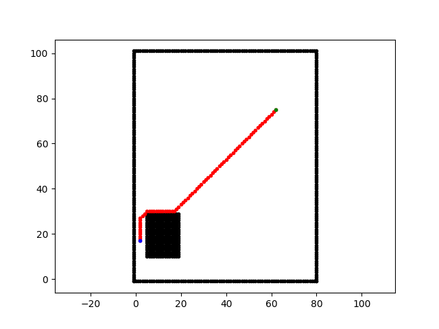

# Algorithms for Robotics

This repository is my implementation of common algorithms used for autonomous navigation.

# Path Planning

## A*

<b>References:</b>
- [Amit's A* pages](http://theory.stanford.edu/~amitp/GameProgramming/)

## Lifelong Planning A*

<b>References:</b>
- [Lifelong Planning A*](https://www.cs.cmu.edu/~maxim/files/aij04.pdf)

## RRT

<b>References:</b>
- [Rapidly-Exploring Random Trees: A New Tool for Path Planning](http://msl.cs.illinois.edu/~lavalle/papers/Lav98c.pdfhttp://msl.cs.illinois.edu/~lavalle/papers/Lav98c.pdf)

## RRT*

<b>References:</b>
- [Incremental Sampling-based Algorithms for Optimal Motion Planning](http://roboticsproceedings.org/rss06/p34.pdf)

# Controllers

## Pure Pursuit

## Stanley Controller

<b>References:</b>
- [Stanley: The Robot that Won the DARPA Grand Challenge](http://robots.stanford.edu/papers/thrun.stanley05.pdf)

## LQR controller

<b>References:</b>
- [A Tutorial On Autonomous Vehicle Steering Controller Design, Simulation and Implementation](https://arxiv.org/pdf/1803.03758.pdf)

## MPC controller

<b>References:</b>
- Predictive Control for Linear and Hybrid Systems

# Credits
This repository was inspired from [PythonRobotics](https://github.com/AtsushiSakai/PythonRobotics).
