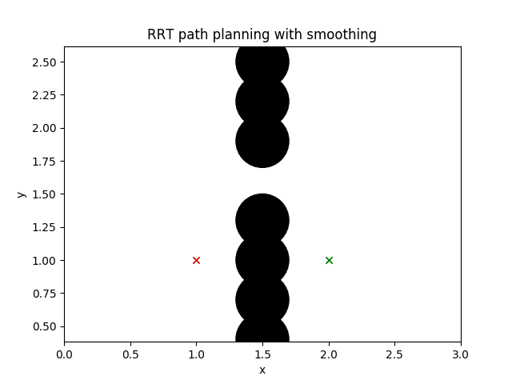

# Algorithms for Robotics

This repository is my implementation of common algorithms used for autonomous navigation.

# Path Planning

## A*

## RRT

## RRT*

# Controllers

## Pure Pursuit

## Stanley Controller

## LQR controller

## MPC controller

# References
This repository was inspired from [PythonRobotics](https://github.com/AtsushiSakai/PythonRobotics).
